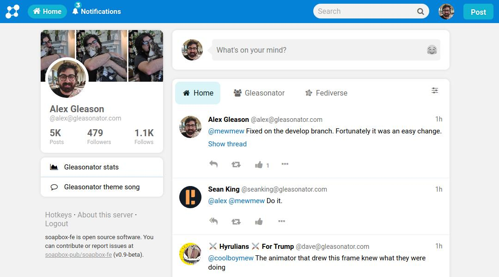

<!--
Важно: этот README был автоматически сгенерирован <https://github.com/YunoHost/apps/tree/master/tools/readme_generator>
Он НЕ ДОЛЖЕН редактироваться вручную.
-->

# Soapbox для YunoHost

[](https://ci-apps.yunohost.org/ci/apps/soapbox/)  

[](https://install-app.yunohost.org/?app=soapbox)

*[Прочтите этот README на других языках.](./ALL_README.md)*

> *Этот пакет позволяет Вам установить Soapbox быстро и просто на YunoHost-сервер.*  
> *Если у Вас нет YunoHost, пожалуйста, посмотрите [инструкцию](https://yunohost.org/install), чтобы узнать, как установить его.*

## Обзор

Soapbox is customizable open-source software that puts the power of social media in the hands of the people.
Feature-rich and hyper-focused on providing a user experience to rival Big Tech, Soapbox is already home to some of the biggest alternative social platforms.


**Поставляемая версия:** 3.2.0~ynh3

## Снимки экрана



## Документация и ресурсы

- Официальный веб-сайт приложения: <https://soapbox.pub/>
- Официальная документация администратора: <https://docs.soapbox.pub/>
- Репозиторий кода главной ветки приложения: <https://gitlab.com/soapbox-pub/soapbox-fe>
- Магазин YunoHost: <https://apps.yunohost.org/app/soapbox>
- Сообщите об ошибке: <https://github.com/YunoHost-Apps/soapbox_ynh/issues>

## Информация для разработчиков

Пришлите Ваш запрос на слияние в [ветку `testing`](https://github.com/YunoHost-Apps/soapbox_ynh/tree/testing).

Чтобы попробовать ветку `testing`, пожалуйста, сделайте что-то вроде этого:

```bash
sudo yunohost app install https://github.com/YunoHost-Apps/soapbox_ynh/tree/testing --debug
или
sudo yunohost app upgrade soapbox -u https://github.com/YunoHost-Apps/soapbox_ynh/tree/testing --debug
```

**Больше информации о пакетировании приложений:** <https://yunohost.org/packaging_apps>
